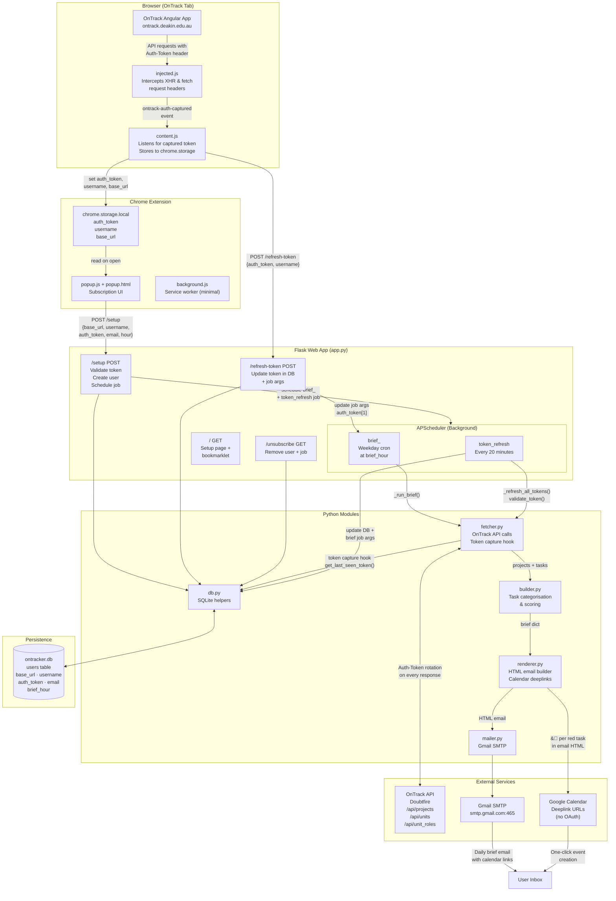

# OnTrack Brief — Architecture



## Component Responsibilities

| Component | File | Role |
|---|---|---|
| `injected.js` | `extension/injected.js` | Runs inside OnTrack page context; patches XHR/fetch to capture `Auth-Token` from outgoing request headers |
| `content.js` | `extension/content.js` | Bridge between page and extension; stores token in `chrome.storage`, pushes to `/refresh-token` |
| `popup.js` | `extension/popup.js` | Subscription UI; reads stored credentials and POSTs to `/setup` |
| `background.js` | `extension/background.js` | Minimal service worker; keeps extension registered |
| Flask routes | `app.py` | `/setup`, `/refresh-token`, `/unsubscribe`, `/` |
| APScheduler | `app.py` | `brief_<id>` (weekday cron) + `token_refresh` (every 20 min) |
| `fetcher.py` | `fetcher.py` | All OnTrack API calls; response hook captures latest rotated token via `get_last_seen_token()` |
| `builder.py` | `builder.py` | Categorises tasks into urgent/todo/waiting/submitted/done; scores by red band → grade → deadline |
| `renderer.py` | `renderer.py` | Builds HTML email; inlines Google Calendar deeplinks on red tasks (≤3 days) |
| `mailer.py` | `mailer.py` | Sends via Gmail SMTP (port 465 SSL) |
| `db.py` | `db.py` | SQLite CRUD for the `users` table |

## Token Rotation Flow

```
User logs in to OnTrack
        │
        ▼
injected.js captures Auth-Token from request headers
        │
        ├──► chrome.storage.local (popup reads this)
        │
        └──► POST /refresh-token ──► DB + brief job args updated
                                              │
                          ┌───────────────────┤
                          │  Every 20 minutes │
                          ▼                   │
              validate_token() ──► OnTrack    │
              (rotated token saved to DB      │
               + brief job args updated) ─────┘
                          │
                          ▼
              _run_brief() at scheduled hour
              fetch_active_projects() ──► OnTrack (rotates token)
              build_brief() ──► multiple API calls (each rotates token)
              get_last_seen_token() ──► save final token to DB + job args
```
